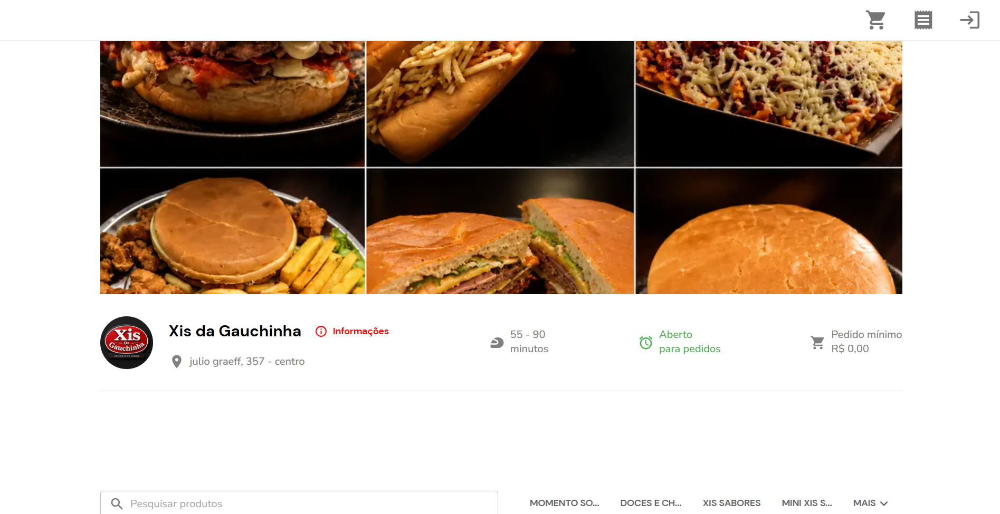
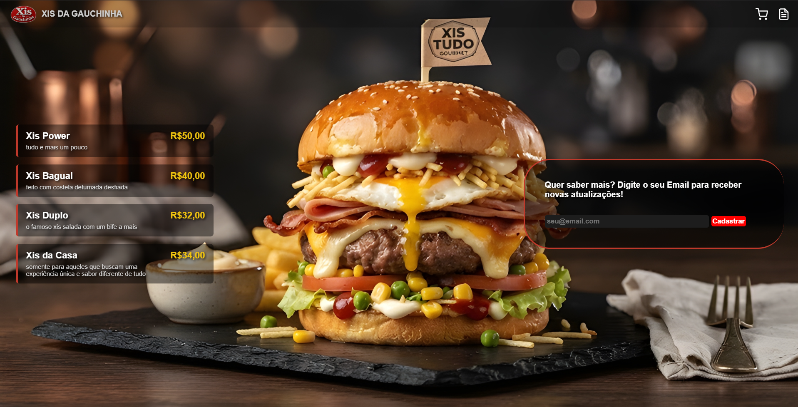

# Clone Page - Xis da Gauchinha

Trabalho prático da disciplina de **Front-End** (Atitus Educação), referente ao G1.

## Autores
* **1139745** - Nick Eduardo dos Santos
* **1139819** - Lucas Gazolla

---

## Link do Site de Referência
* **Referência Original:** [Xis da Gauchinha](https://xisdagauchinha.compraqui.app/)

---

## Checklist de Requisitos (Parte 1)

### 1.1 Estrutura HTML Semântica e Acessível
* **Uso de tags semânticas:** A estrutura foi construída utilizando tags como `<header>`, `<main>`, e `<footer>` para organizar o conteúdo de forma clara e acessível.
* **Atributo `alt` em imagens:** Todas as imagens da página possuem descrições adequadas (`alt` descritivo), garantindo acessibilidade para leitores de tela.
* **Formulário acessível:** A página conta com um formulário funcional localizado no rodapé para cadastro de e-mail, associando corretamente o elemento `<label>` com o campo de entrada (`<input id="email">`).

### 1.2 Fidelidade Visual à Referência Escolhida
* O projeto replica a interface do site de referência, mantendo a identidade visual com foco em um fundo escuro, cartões de menu translúcidos com bordas destacadas e tipografia limpa.
* **Justificativa de diferenças:** Fontes padrão da web (Arial/Quicksand) foram utilizadas como equivalentes visuais para manter a consistência e leveza de carregamento.

### 1.3 CSS: Seletores, Box Model e Variáveis
O código CSS utiliza diversos conceitos fundamentais da estilização web:
* **Variáveis CSS (`:root`):** Utilizadas para definir propriedades reutilizáveis, como o raio de borda (`--raio-borda`).
* **Seletores aplicados:**
  1. *Seletor de Classe* (ex: `.menu-item`, `.topbar`) para estilizar componentes reutilizáveis.
  2. *Seletor Descendente* (ex: `.menu .menu-item`) para garantir escopo e especificidade controlada.
  3. *Pseudo-classes* (ex: `.menu-item:hover`, `.entradaEmail:focus`) para criar interações dinâmicas ao passar o mouse ou focar nos campos.

### 1.4 Responsividade: Flexbox, Grid e Mobile First
* **Abordagem Mobile First:** O código base foi estruturado pensando primeiro em dispositivos móveis, complementado por *Media Queries* (`max-width: 1024px` e `max-width: 480px`) para adaptar o layout em telas de desktop e tablet.
* **Flexbox:** Amplamente utilizado para o alinhamento de itens do menu, barras de navegação e componentes flexíveis.

### 1.5 Personalização e Originalidade
* **Seção de Rodapé e Captura de E-mail:** Foi estilizado um formulário de captura de atualizações integrado ao rodapé com efeitos de transição modernos e foco em usabilidade.

---

## 📷 Comparativo Visual

